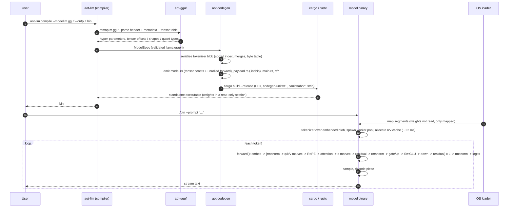

# aot-llm

Ahead-of-time compiler that turns a quantized GGUF model into **one native executable**: no runtime, no Python, no interpreter, no model file to load. The weights are placed in a read-only section of the binary, the OS maps them lazily, and the first forward pass starts about **0.2 ms** after `main()`.

```text
$ aot-llm compile --model tinyllama-1.1b-chat-v1.0.Q4_K_M.gguf --output ./tinyllama_bin
[1/4] parsed tinyllama-1.1b-chat-v1.0.Q4_K_M.gguf (GGUF v3, 201 tensors, 23 metadata keys)
      tinyllama | llama | 1.100B params | MOSTLY_Q4_K_M | dim 2048 hidden 5632 layers 22 heads 32/4 vocab 32000
[2/4] tokenizer: spm 32000 tokens, chat template: zephyr, blob 613.4 KB
[3/4] generated project in ./tinyllama_bin.build (22 layers unrolled, weights embedded)
[4/4] cargo build --release ...
done: ./tinyllama_bin (642.3 MB) in 10.8s

$ ./tinyllama_bin --prompt "The capital of France is" -n 32
 Paris.

2. B.C. The capital of ancient Rome was Rome.
[aot-llm] startup 0.190 ms (threads 0.111, tokenize 0.076) | prompt 6 tok (97 tok/s) | gen 32 tok (107 tok/s) | peak RSS 608 MB | 8 threads | neon+dotprod
```

The output is byte-for-byte identical to llama.cpp (via Ollama) for the same GGUF under greedy decoding.

## Where it wins, and where it does not

aot-llm is about **first-response latency and packaging**, not raw throughput. Same GGUF, same Apple M1 Pro, 8 threads (details in [`docs/benchmarks/`](docs/benchmarks/README.md)):

| | aot-llm | Ollama / llama.cpp |
|---|---|---|
| process start → ready to decode | **0.2–0.8 ms** | 0.5–2.8 s model load, and the server must already be running |
| chat reply with a fixed system prompt, first token (warm) | **90–160 ms** (baked KV prefix) | ~500–780 ms per request (CPU), ~470 ms (Metal) |
| cold first token (nothing in the page cache) | 0.6–0.7 s | 1.3–4.6 s |
| resident memory | 614–773 MiB | 766–1586 MiB plus ~40 MiB of server/app |
| decode, CPU | **113–128 tok/s** | 86–117 tok/s |
| decode, GPU | none | 139–150 tok/s (Metal) |
| long prompt evaluation | 200–260 tok/s | 410–510 tok/s |
| deployment | one file, no runtime, no daemon; copy and run; static Linux cross-build | install Ollama, pull the model, keep a server up |
| models | `llama` architecture, 8 tensor types | every architecture and quantization |

**Good fit:** command-line tools, agents that call a model many times for short answers, edge / serverless / cron jobs where a process spawns, answers and exits, embedding a model in an application.

**Poor fit:** multi-user chat servers, very long prompts (RAG, documents), anything that needs a GPU. vLLM and friends solve a different problem (batched GPU serving, cold starts of tens of seconds) and are not comparable for one process answering one request.

## What it does

* **Zero runtime overhead.** The generated program depends only on `std`. Argument parsing, tokenizer, kernels, sampler: all compiled into one static binary (`opt-level=3`, fat LTO, one codegen unit, `panic=abort`, stripped).
* **Zero-copy weights.** The tensor data section of the GGUF file is copied verbatim into a private read-only section of the executable with the assembler's `.incbin` directive. The loader `mmap`s it like any other segment, so starting the binary costs no I/O; pages are faulted in on first touch. A `--sidecar` mode keeps the weights in a separate file that the binary `mmap`s at startup.
* **Static code generation.** The compiler reads the model graph from GGUF metadata and emits `model.rs`: a tensor table with byte offsets, and a `forward()` whose per-layer code is unrolled with the kernel for each tensor's quantization type chosen at compile time (`matvec_q4_k`, `matvec_q6_k`, ...). There is no graph interpreter.
* **SIMD kernels** for Q4_0, Q8_0, Q4_K, Q5_K, Q6_K, F16, BF16 and F32 weights: NEON (with `sdot` when available) on ARM64, AVX2 + FMA (+ F16C) on x86_64, scalar fallback. The implementation is picked once at startup, so a binary runs on any CPU of its architecture.
* **Batched prompt processing.** Prompt tokens go through the model in chunks of up to 64 (`--batch`); each weight row is read once per chunk and multiplied against four activations at a time by 1x4 micro-kernels, so prompt evaluation is compute-bound rather than memory-bound. Results are bit-identical to token-by-token evaluation.
* **Compile-time KV prefix cache.** `aot-llm compile --system "..."` evaluates the system prompt at build time and embeds its key/value cache in the binary; a chat prompt with that system prompt skips straight to the user turn.
* **Background prefault.** At startup worker threads page the weights in (`madvise` + page touch) while the main thread tokenizes, which shortens cold first-token latency. `--no-prefetch` turns it off.
* **Single-binary output.** `aot-llm compile` writes a standalone Cargo project and builds it; cross-compiling to `x86_64-unknown-linux-musl` from macOS produces a static ELF.

## Quick start

Requirements: Rust 1.98+ (the kernels use `vdotq_s32`), a Llama-architecture GGUF (TinyLlama, Llama 2/3/3.2, Mistral 7B, ...).

```bash
git clone https://github.com/p10node/aot-llm && cd aot-llm
cargo build --release

# Inspect what will be compiled
./target/release/aot-llm inspect ./Llama-3.2-1B-Instruct-Q4_K_M.gguf

# Compile (about 10-15 s on an M1 Pro; the GGUF is embedded, not copied)
./target/release/aot-llm compile --model ./Llama-3.2-1B-Instruct-Q4_K_M.gguf --output ./llama32

# Optional: bake the KV cache of a fixed system prompt into the binary (two build passes)
./target/release/aot-llm compile --model ./Llama-3.2-1B-Instruct-Q4_K_M.gguf --output ./llama32 \
    --system "You are a concise assistant. Answer in one short paragraph."

# Run
./llama32 --prompt "The capital of France is" -n 32
./llama32 --chat --prompt "Write one sentence about the moon." --temp 0.7
./llama32 --chat --system "You are a concise assistant. Answer in one short paragraph." --prompt "Why is the sky blue?"   # uses the baked prefix
./llama32 --info
```

Generated binary options:

```text
-p, --prompt TEXT        Prompt text (reads stdin when omitted)
-n, --max-tokens N       Maximum tokens to generate [default: 128]
    --temp F             Sampling temperature, 0 = greedy [default: 0]
    --top-k N            Top-k filter, 0 = off [default: 40]
    --top-p F            Nucleus sampling threshold [default: 0.95]
    --repeat-penalty F   Repetition penalty, 1 = off [default: 1.0]
    --seed N             RNG seed [default: 42]
-c, --ctx N              Context length [default: prompt + max-tokens]
-t, --threads N          Worker threads [default: min(cores, 8)]
-b, --batch N            Prompt tokens per batched step, 1 = token by token [default: 64]
    --chat               Wrap the prompt in the model's chat template (llama3 / zephyr / chatml / llama2 / mistral / gemma)
    --system TEXT        System prompt for --chat
    --no-bos             Do not prepend the BOS token
    --no-prefetch        Do not page in the weights from background threads at startup
    --no-prefix-cache    Ignore the compile-time KV prefix cache
    --kernels NAME       auto | scalar | neon | neon-dotprod | avx2
    --weights PATH       Sidecar weights file (sidecar builds only)
    --show-special       Print special tokens
    --tokens             Print token ids instead of text
    --dump-logits        Print the logits of the last prompt token and exit
-q, --quiet              Do not print statistics to stderr
    --info               Print model information and exit
```

Compiler options (`aot-llm compile --help`): `--system TEXT` / `--prefix TEXT` (bake a KV prefix cache), `--target <triple>`, `--native` (`-C target-cpu=native`), `--sidecar`, `--emit-only` (generate the project without building), `--build-dir`, `--name`, `-j`, `-q`.

Debugging: `AOT_DEBUG_COMPARE=1 ./bin ...` re-evaluates the prompt token by token and reports the first KV-cache divergence from the batched path; `--dump-logits` prints the logits of the last prompt token.

## How it works



The static pipeline emitted for every model is

```text
tokens -> embedding -> [RMSNorm -> Attention(GQA, RoPE, KV cache) -> + -> RMSNorm -> SwiGLU FFN -> +] x N -> RMSNorm -> logits -> sampler
```

Per matmul, the f32 activation vector is quantized once to Q8_0 (for Q4_0/Q8_0 weights) or Q8_K (for K-quants) and every output row is an integer dot product scaled back to f32, the same scheme ggml uses, so results match llama.cpp. During decoding the q/k/v projections form one parallel region and gate/up another; rows are handed out in dynamic chunks; attention is parallel over heads. The thread pool keeps workers hot between the few hundred small parallel regions of a decode step.

Prompt tokens are processed by `forward_batch` in chunks: every weight row is loaded once per chunk and the 1x4 micro-kernels decode each quantized block once for four activations, so prompt evaluation runs several times faster than decoding. With `--system`, the compiler builds the binary twice: pass 1 evaluates the system prefix with the final kernels and writes its KV cache, pass 2 embeds that blob in a read-only section; at run time a prompt whose tokens start with the baked prefix loads the rows with a memcpy and evaluates only the user turn.

### Repository layout

| crate                | role                                                                                                                                                                                |
|----------------------|-------------------------------------------------------------------------------------------------------------------------------------------------------------------------------------|
| `crates/aot-gguf`    | GGUF v2/v3 parser (header, metadata, tensor descriptors), memory-mapped access, in-memory writer for tests                                                                          |
| `crates/aot-kernels` | the runtime: quant layouts, SIMD matvec kernels, RMSNorm / RoPE / attention, thread pool, tokenizer, sampler, CLI driver. Copied verbatim into every generated project as `src/rt/` |
| `crates/aot-codegen` | graph extraction (`ModelSpec`), tokenizer blob builder, Rust project emitter, cargo driver                                                                                          |
| `crates/aot-llm`     | the `aot-llm` CLI: `compile`, `inspect`, `tokenize`                                                                                                                                 |

## Benchmarks

The tables below are the initial measurements of the first release. Every later optimisation step is measured with `scripts/bench.py` and recorded under [`docs/benchmarks/`](docs/benchmarks/README.md) (one file per step, cold/warm/chat columns, plus the Ollama reference). Summary of the steps so far (Apple M1 Pro, 8 threads, medians; "chat" = 88-token prompt with a 66-token system prompt for TinyLlama, 70/55 for Llama 3.2):

| step | TinyLlama Q4_K_M chat first token | Llama-3.2-1B chat first token | TinyLlama decode | Llama-3.2-1B decode |
|---|---|---|---|---|
| baseline (`bf6f95b`) | 685 ms | 777 ms | 104 tok/s | 61–87 tok/s |
| batched prompt + 1x4 micro-kernels | 424 ms | 488 ms | 116 tok/s | 83 tok/s |
| + background prefault | 375 ms (cold first token 652 → 642 ms) | 302 ms (1030 → 711 ms) | 114 tok/s | 93 tok/s |
| + fused q/k/v, dynamic chunks, `fcvt` scales | 436 ms | 298 ms | **128 tok/s** | **113 tok/s** |
| + baked system-prompt KV cache (`--system`) | **164 ms** | **90 ms** | 128 tok/s | 113 tok/s |

Decode is now at llama.cpp's CPU speed (117 / 86 tok/s in Ollama), and a chat reply with a baked system prompt starts in about 100 ms instead of 700–1000 ms. The baseline tables that follow are kept for reference.

Machine: Apple M1 Pro (8 performance + 2 efficiency cores, 16 GB), macOS, Rust 1.99. Prompt: 11-13 tokens, 64 generated tokens, greedy, warm page cache, 8 threads, median of 3 runs on an otherwise idle machine. Ollama 0.34.4 with its bundled llama.cpp `llama-server`, same GGUF files imported with `ollama create`, measured through `/api/generate` (`raw: true`); "cold" means after `ollama stop`.

### Startup latency

|                                                       | TinyLlama-1.1B Q4_K_M                     | Llama-3.2-1B-Instruct Q4_K_M |
|-------------------------------------------------------|-------------------------------------------|------------------------------|
| **aot-llm** process start -> ready to decode          | **0.19 ms** (threads 0.11, tokenize 0.08) | **0.27 ms**                  |
| aot-llm time to first token (warm cache)              | 120 ms (prompt eval)                      | 110 ms                       |
| Ollama cold request, CPU (model load / total)         | 1.57 s / 2.33 s                           | 2.84 s / 4.61 s              |
| Ollama cold request, Metal GPU (model load / total)   | 0.54 s / 1.34 s                           | 0.83 s / 1.48 s              |
| Ollama warm request overhead (model already resident) | ~0.58 s total for 64 tokens               | ~0.78 s                      |

"Ready" for aot-llm means the weights are mapped, the tokenizer has encoded the prompt, the worker pool is up and the KV cache is allocated. Nothing is read from disk at startup; the first forward pass pages the weights in (about 0.6 s on a cold page cache for 640 MB, like any mmap-based loader).

### Memory

|                                                      | TinyLlama-1.1B Q4_K_M | Llama-3.2-1B-Instruct Q4_K_M |
|------------------------------------------------------|-----------------------|------------------------------|
| **aot-llm** peak RSS (whole process, incl. KV cache) | **608 MiB**           | **770 MiB**                  |
| aot-llm binary on disk                               | 642 MiB               | 776 MiB                      |
| Ollama `llama-server` RSS, CPU mode                  | 798 MiB               | 1586 MiB                     |
| Ollama `llama-server` RSS, GPU mode                  | 766 MiB               | 1420 MiB                     |
| Ollama `ollama serve` + app processes                | ~40 MiB               | ~40 MiB                      |

aot-llm's RSS is essentially the touched weight pages (636 / 763 MiB of tensor data) plus a context-sized KV cache; there is no second copy of anything.

### Throughput (CPU, 8 threads unless noted)

|                                              | TinyLlama-1.1B Q4_K_M | TinyLlama-1.1B Q4_0 | Llama-3.2-1B Q4_K_M |
|----------------------------------------------|-----------------------|---------------------|---------------------|
| **aot-llm** decode                           | **107 tok/s**         | 85 tok/s            | **86 tok/s**        |
| aot-llm prompt eval (token by token)         | 107 tok/s             | 90 tok/s            | 100 tok/s           |
| Ollama / llama.cpp CPU decode                | 117 tok/s             | -                   | 86 tok/s            |
| Ollama / llama.cpp CPU prompt eval (batched) | 510 tok/s             | -                   | 412 tok/s           |
| Ollama / llama.cpp Metal GPU decode          | 150 tok/s             | -                   | 139 tok/s           |

Decode speed is within ~10% of llama.cpp's CPU path. Prompt evaluation is the known gap: aot-llm processes prompt tokens one at a time (matrix-vector), while llama.cpp batches them into matrix-matrix products. Using 10 threads on this machine (i.e. the two efficiency cores) drops throughput to ~20 tok/s because every parallel region waits for its slowest worker, hence the default cap of 8.

**vLLM** was not benchmarked: it needs a CUDA GPU, and it is a serving engine (continuous batching, paged attention) whose cold start loads weights into GPU memory and captures CUDA graphs, which takes seconds to minutes. It is the wrong tool for the "start a process, answer, exit" use case this project targets, which is why the comparison above is against Ollama.

## Correctness

* `cargo test --workspace` runs
  * unit tests for the GGUF parser, f16 conversion, quantizers, pool, ops, sampler and tokenizer pre-tokenizers;
  * `crates/aot-kernels/tests/dots.rs`: every SIMD dot product (NEON, NEON+dotprod, AVX2, AVX2+F16C) against the scalar reference and a float reference, for every supported weight type;
  * `crates/aot-codegen/tests/tokenizer_blob.rs`: SentencePiece and byte-level BPE round trips through the serialised blob;
  * `crates/aot-llm/tests/e2e.rs`: builds a tiny random Llama GGUF that uses all eight weight types, compiles it with the CLI, runs the binary with `--dump-logits` and compares against an f32 reference forward pass (max error 0.0000 on the logits).
* Tokenization was checked against llama.cpp ids for both vocabularies (e.g. Llama 3 `"Hello world"` -> `[128000, 9906, 1917]`, TinyLlama -> `[1, 15043, 3186]`).
* Greedy generations of both real models match Ollama/llama.cpp token for token.
* The AVX2 kernels were validated by running the test suite under `docker run --platform linux/amd64`; a TinyLlama binary cross-compiled to `x86_64-unknown-linux-musl` runs in the same container (`avx2+f16c`).

## Cross-compiling

```bash
rustup target add x86_64-unknown-linux-musl
aot-llm compile --model m.gguf --output ./m_linux --target x86_64-unknown-linux-musl
file ./m_linux   # ELF 64-bit LSB pie executable, x86-64, static-pie linked, stripped
```

For `*-musl` targets the generated project links with `rust-lld` and the self-contained musl CRT, so no cross toolchain is needed. Other targets need a linker for that platform (`.cargo/config.toml` in the generated project is the place to set it).

## Supported models and limits

* Architecture `llama` as written by `convert_hf_to_gguf.py`: Llama 1/2/3/3.1/3.2, TinyLlama, Mistral 7B, Vicuna, OpenLLaMA and other derivatives without biases. RoPE "normal" layout, grouped-query attention, RMSNorm, SwiGLU, tied or separate output head, Llama 3.x RoPE frequency factors, linear RoPE scaling.
* Tensor types: `f32`, `f16`, `bf16`, `q4_0`, `q8_0`, `q4_K`, `q5_K`, `q6_K` (covers `Q4_0`, `Q8_0`, `Q4_K_S/M`, `Q5_K_S/M`, `Q6_K`, `F16` files). `iq*`, `q2_K`, `q3_K`, `q4_1`, `q5_0/1` are rejected with a message naming the tensor.
* Tokenizers: SentencePiece (`llama`) and byte-level BPE (`gpt2` with the Llama 3 or GPT-2 pre-tokenizer).
* Single sequence, batch size 1, CPU only, unix targets (the weight embedding uses `global_asm!`, memory mapping uses `mmap`).
* Not yet: batched prompt processing, KV-cache quantization, other architectures (Qwen2, Gemma, Phi), GPU.

`unsafe` is confined to SIMD intrinsics, the `.incbin` symbol and `mmap` views, and the fork-join pool's lifetime-erased job pointer and disjoint-range writes; each site is commented with its invariant.

## License

MIT or Apache-2.0, at your option.
